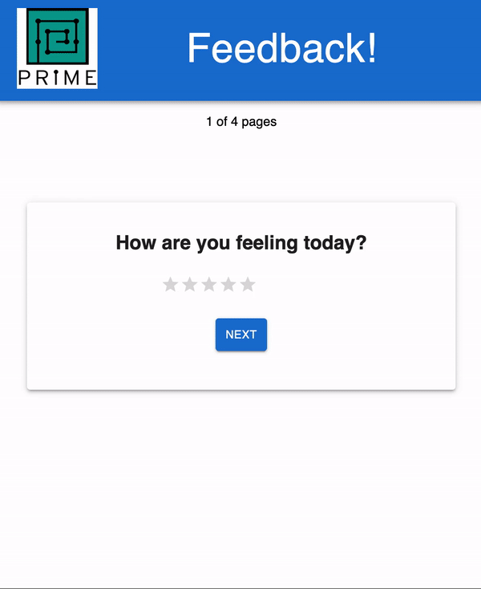

# Feedback Application 

## Description

_Duration: 2 days Sprint_

The feedback application is an interactive and user-friendly web-based tool created for collecting feedback from users on a daily basis. It is comprised of a multi-part form that enables users to leave their rating response in four areas: their feeling, their understanding of the content, their support experience, and any other comments they wish to provide. Overall, this application is an efficient and effective way of collecting feedback in a well-structured and clear manner. The user experience is enhanced by the multi-part form, intuitive navigation, and submission success page, making it a highly user-friendly and engaging platform.

---
## **TABLE OF CONTENT:**
1. [App Demo](#app-demo)
1. [Installation](#installation)
1. [Usage](#usage)
1. [Technologies utilization](#technologies-utilization)

---
## App Demo

---

## Installation
1. $ `git clone`
1. `npm install`
1. `npm run server` in your terminal
1. `npm run client` in another terminal. This should open up a new browser tab.

---

## Usage
To add new feedback, follow these steps:

1. The form is divided into four sections: your feeling, understanding, support, and comments.
1. Choose a score between 1 and 5 using the star icon rating system to rate your experience in the first three sections. One star represents the lowest score, while five stars represent the highest score. Click the "next" button to proceed to the next section after rating.
1. In the fourth section, leave any additional comments or leave it empty, as it is not required. Then, click the "next" button to proceed to the next section.
1. On the review page, you can review your feedback values, but you will not be able to change your input on this page.
1. Click the "submit" button to submit your completed feedback to the server.
1. The application will save the submission in the database, and you will see a submission success notification.
1. If you want to reset all the data and start a new survey, click the "next" button to go back to the first step.

---

## Technologies utilization 

* Javascript
* HTML
* CSS
* [React](https://reactjs.org/)
* [React Router v5](https://v5.reactrouter.com/web/guides/quick-start)
* [Redux](https://redux.js.org/)
* [Node js](https://nodejs.org/en/about/)
* [Express js](https://expressjs.com/)
* [Axio](https://axio.com/)
* [Postico 2](https://eggerapps.at/postico2/)
* [PostgreSQL](https://www.postgresql.org/)
* [Postman](https://www.postman.com/)
* [GitHub](https://github.com/xaihang/) 
* [Material UI](https://mui.com/)
* [SweetAlert2](https://sweetalert2.github.io/)

